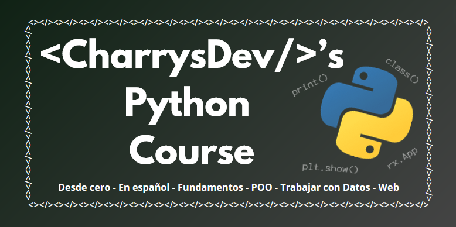

# CharrysDev's Python Course

Python es actualmente el lenguaje más usado en todos el mundo, y no es para menos, hablamos de un lenguaje que sirve para todo lo que nos propongamos. Utilizado en IA, Machine Learning o Ciencia de Datos, Python es un lenguaje especial no solo por sus capacidades, sino también por lo sencillo que es de aprender, por lo que también es la mejor opción para aquellos que desean adentrarse en el mundo de la programación.

Mi nombre es David Santiago Charrys Pacheco soy Desarrollador Full-Stack y te doy la bienvenida a este Curso de Python desde cero y para principiantes en la programación. En este curso serás introducido a los conceptos básicos de la programación, conoceras la sintaxis de Python, y aprenderás a usar Python en Programación Orientada a Objetos (POO), para trabajar con datos y para Desarrollo Web. Además, el curso está escrito usando Jupyter, por lo que tendrás celdas con ejemplos de código que podrás ejecutar a medida que lees y también tendrás ejercicios con los que podrás reforzar tu lógica de programación.

¿Estás listo? Pues no se diga más, empieza tu recorrido por la carpeta llamada `Getting Started With Python`.

[CharrysDev-Python-Course](https://github.com/CharrysDev/CharrysDev-Python-Course) © 2024 by [David Charrys](https://github.com/CharrysDev) is licensed under [CC BY-SA 4.0](https://creativecommons.org/licenses/by-sa/4.0/)

